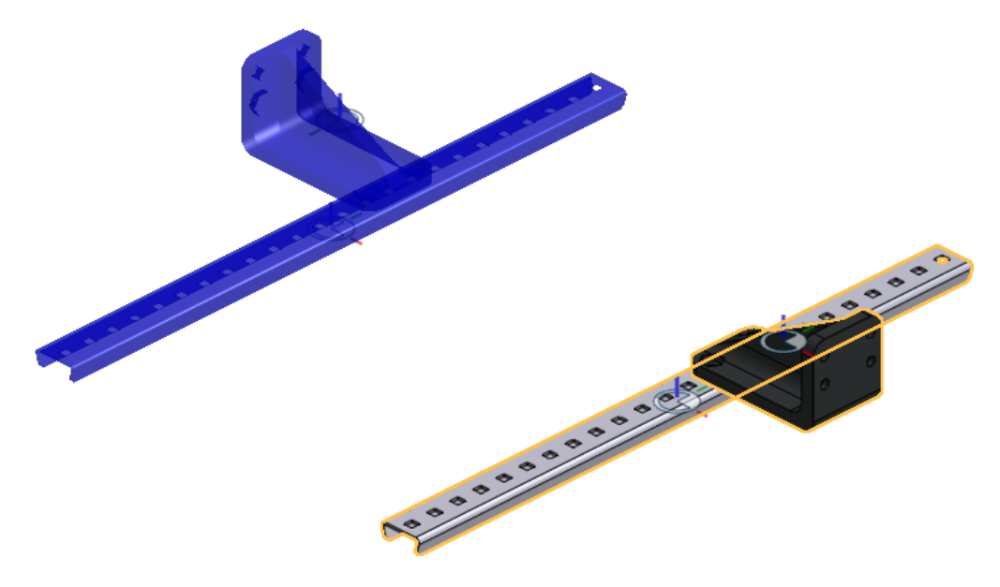
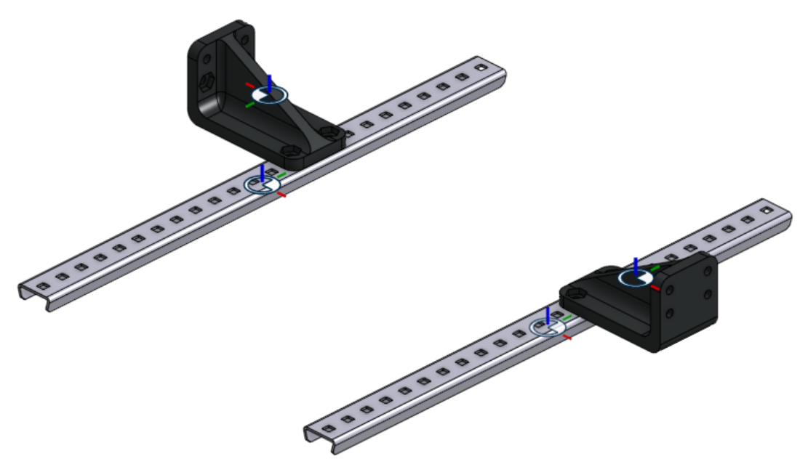
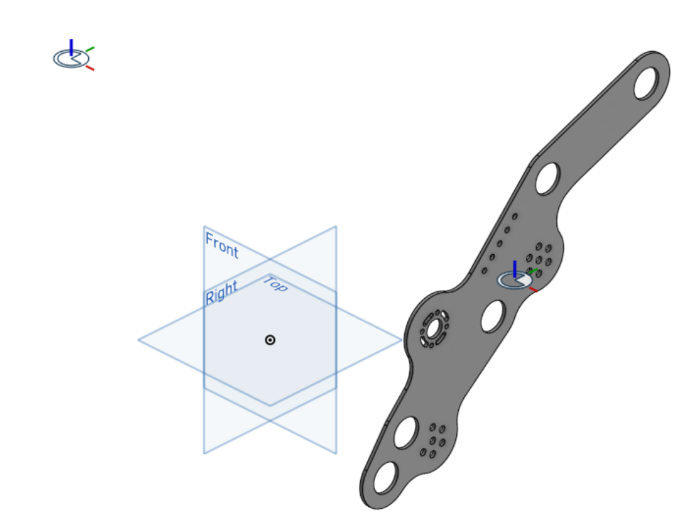
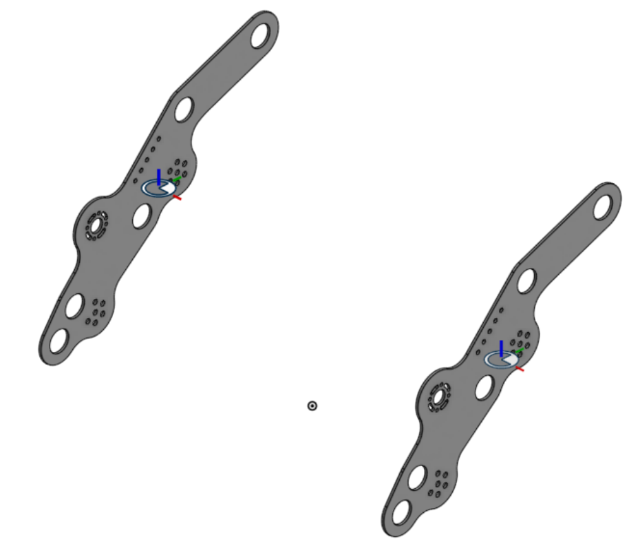
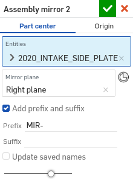

Assembly mirror
===============

|top1| |top2|

Assembly mirror facilitates the assembly of parts by adding mate connectors to parts which allow instances of those parts to be quickly placed in mirrored positions in assemblies.

.. important::
    Since FeatureScripts cannot be used directly in assemblies, the Assembly mirror feature cannot create transformed copies of parts directly inside assemblies. Instead, the Assembly mirror feature works by adding mate connectors to parts inside part studios which allow copies of those parts to be assembled into mirrored positions later on.

    |pic1| |pic2|

The Assembly mirror FeatureScript can be found here: `Assembly mirror document <https://cad.onshape.com/documents/0f7d68295ff4dab57adcf92c/w/665f10f209a25a1f8883d8b5/e/1ad7ea5f13d67f72a3907dde>`_

Steps for creating mirrored parts
---------------------------------

  #. Create an Assembly mirror feature by selecting it from your :term:`FeatureScript dropdown`.
  #. Specify your desired result behavior (**Part center** or **Origin**).

    .. seealso::
        :ref:`result-behavior` for more information.

  #. Select one or more **Entities** (parts or surfaces) to find transforms for.
  #. Select a **Mirror plane** to mirror about.
  #. The Assembly mirror feature will automatically try each possible transform type (**Linear**, **Z axis**, **Y axis**, **X axis**, and **Mirror**) for each part and select the one that matches a part to its mirror image.

    If a valid transform is found, the transform type of the part will be updated with the valid transform, a mirror image of the part will be shown in blue in the :term:`graphics window<Graphics window>`, and a mate connector which can be used to assemble the part in the location of its mirror image will be created.

    .. image:: assemblyMirrorPartGhost.png
        :width: 70%
        :align: center
        :alt: An example Assembly mirror part studio

    Otherwise, the transform type of the part will be changed to **Mirror**, and a mirrored copy of the part will be created.

    .. warning::
        Since Assembly mirror cannot compute surface transform types automatically, the transform type of surfaces will always default to **Mirror** and will need to be changed manually.

    .. note::
        The transform type will only be computed automatically when a feature is first selected. If you make changes to the part later on, you may need to reselect the part or update the transform type manually.

#. Choose whether to **Add prefix and suffix** to the mirrored versions of entities. 
#. If **Add prefix and suffix** is selected and the name of the part is changed, the name of the mirrored part may not update to match the change. This can be fixed by selecting **Update saved names**, and then **Confirm**, to update the internally saved names of every part
#. |confirm-feature|

Steps for creating mirrored parts using preselections
-----------------------------------------------------

#. Before creating an Assembly mirror feature:

    * Pre-select a **Mirror plane** and one or more **Entities** to mirror by either:

        * Selecting parts and planes directly from the :term:`feature tree<Feature tree>` or :term:`parts list<Parts list>`
        * Selecting geometry (edges, faces, or vertices) in the :term:`graphics window<Graphics window>` which touch the entities you'd like to use

    .. image:: assemblyMirrorPreselection.png
        :width: 60%
        :align: center
        :alt: An example preselection

#. Create an Assembly mirror feature by selecting it from your :term:`FeatureScript dropdown`.
#. The **Entities** and **Mirror plane** parameters are filled in automatically according to your preselections.

    .. image:: assemblyMirrorPreselectionUse.png
        :width: 80%
        :align: center
        :alt: The result of using a preselection
            
#. Specify additional parameters as needed.
#. |confirm-feature|

.. tip::
        Several native Onshape features also support preselections. For example, the Onshape Plane feature will automatically switch to
        **Line angle** mode if you select a plane and a line prior to creating the feature.

.. Steps for assembling mirrored parts
    -----------------------------------

    #. In an assembly, use a combination of mate connectors and additional copies of parts to assemble parts into their mirrored positions.

.. _result-behavior:

Result behavior
---------------
Assembly mirror offers two options for locating mirrored parts; **Part center** and **Origin**.

* **Part center**: Mate connectors are created such that entity mirrors are aligned when their center mate connectors are fastened together.
* **Origin**: Mate connectors are located relative to the world origin, so mirrors are aligned when their mate connectors are fastened to the part studio origin. To assist with this, care should be taken that the assembly origin matches the part studio origin.

.. tip::
    When using **Origin**, make assembling faster and more robust by createing a mate connector at the assembly origin and selecting it via the Mate Features list.