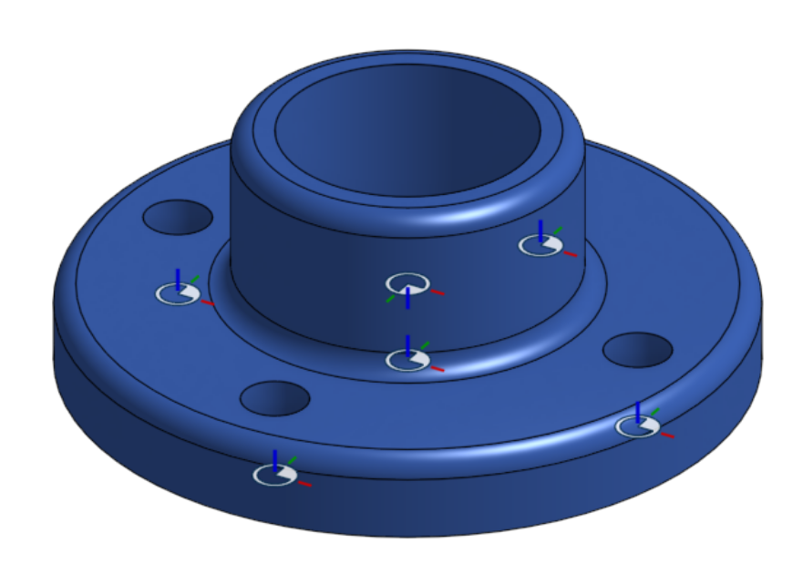
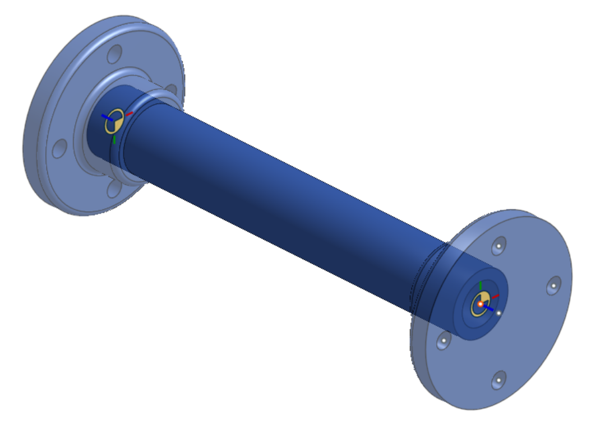

Point derive
============

|pic1| |pic2|

.. |pic2| image:: pointDeriveUse.png
   :width: 49.5%
   :alt: A point derive example

The Point derive feature is a powerful variant of the Onshape Derive feature which allows users to specify locations when deriving parts. Point derive also automatically converts mate connectors attached to parts which are being derived into selectable points, making it possible to choose appropriate mounting features when deriving parts.

The Point derive FeatureScript can be found here: `Point derive document <https://cad.onshape.com/documents/ad42d9d1532c5ea87446b1e8/w/2ed67f49f3f015638cdeb398/e/05f19623ee55474ef77cab5e>`_

Steps for deriving entities
---------------------------

#. Create a Point derive feature by selecting it from your :term:`FeatureScript dropdown`.
#. Specify **Entities to import**.
#. If desired, select one or more **Locations** to place the selected entities at by clicking sketch vertices or mate connectors in the :term:`graphics window<Graphics window>`.
#. If the derived part has any mate connectors, they will automatically be instantiated as selectable points in the :term:`graphics window<Graphics window>`. Choose the appropriate point to use by clicking on it.

    .. note::
        If your selections to derive don't have any attatched mate connectors, no selectable points will appear in the :term:`graphics window<Graphics window>`.

#. If desired, specify a new primary axis to use (**Z axis**, **Y axis**, **X axis**).
#. Use |flip| and |rotate| to reorient **Entities to import** as needed.
#. Choose whether to **Delete planes and sketches** from **Entities to import**.
#. Choose whether to **Delete mate connectors** from **Entities to import**.
#. If desired, specify a part boolean operation (**Add**, **Remove**, or **Intersect**) and a **Merge scope** (or choose **Merge with all**) to boolean parts in **Entities to import** to existing parts in the part studio
#. |confirm-feature|

.. image:: pointDeriveUI.png
        :width: 40%
        :align: center
        :alt: The point derive user interface

Tips for setting up parts to be derived with point derive
---------------------------------------------------------
.. tip::
    * The orientation of mate connectors relative to one another is maintained.
    * The first mate connector in the feature list of the derived part studio serves as the default selected point.
    * Mate connectors do not have to touch derived entities to be used as selectable points.

Examples
--------
.. image:: pointDeriveMotorMount.png
        :width: 60%
        :align: center
        :alt: A motor mount derived using point derive

