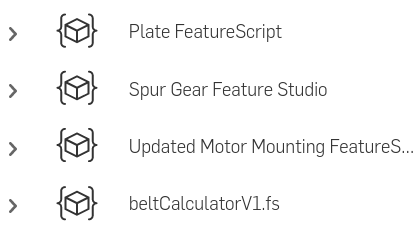
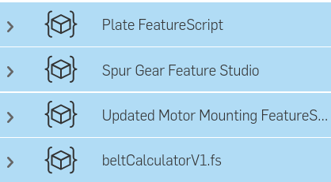

.. _Getting Started:

Getting Started
===============

.. note::
    FeatureScripts are only available inside Onshape part studios - not assemblies or drawings.

Steps for adding FeatureScripts to your toolbar
-----------------------------------------------

#. Open any Onshape document, then open any part studio you can edit.
#. Open your FeatureScript dropdown by clicking on |dropdown| in the rightmost part of your toolbar.
#. Choose **Add custom features** to open the **Add custom features** menu.

    .. image:: addCustomFeatureMenu.png
            :width: 40%
            :align: center
            :alt: The add custom features menu

#. Paste a link to an Onshape document containing one or more FeatureScripts into the top search bar of the **Add custom features** menu.

    .. image:: searchBar.png
        :width: 50%
        :align: center
        :alt: The Add custom features search bar

#. Click |search| or press enter.
#. Click the document which appears.

    .. image:: searchDocument.png
        :width: 40%
        :align: center
        :alt: The Add custom features search bar

#. A list of one or more feature studios should appear. Click each desired FeatureScript to add it to your FeatureScript dropdown, which will cause it to turn blue.

    |pic1| |pic2|

#. Click |X| to close the **Add custom features** menu.

    .. tip::
        Once a FeatureScript has been added to your FeatureScript dropdown, you will be able to use it in every part studio you open.

.. |search| image:: /images/search.png
    :height: 18

Steps for using FeatureScripts
------------------------------

#. Open your FeatureScript dropdown by clicking on |dropdown| in the rightmost part of your toolbar.
#. Choose a FeatureScript you've added from the list of FeatureScripts. An instance of the FeatureScript will be added to your feature tree and allow you to begin making changes.
#. Once you've finished making changes, click |checkmark|.

.. Tips for using feature UI
    -------------------------
