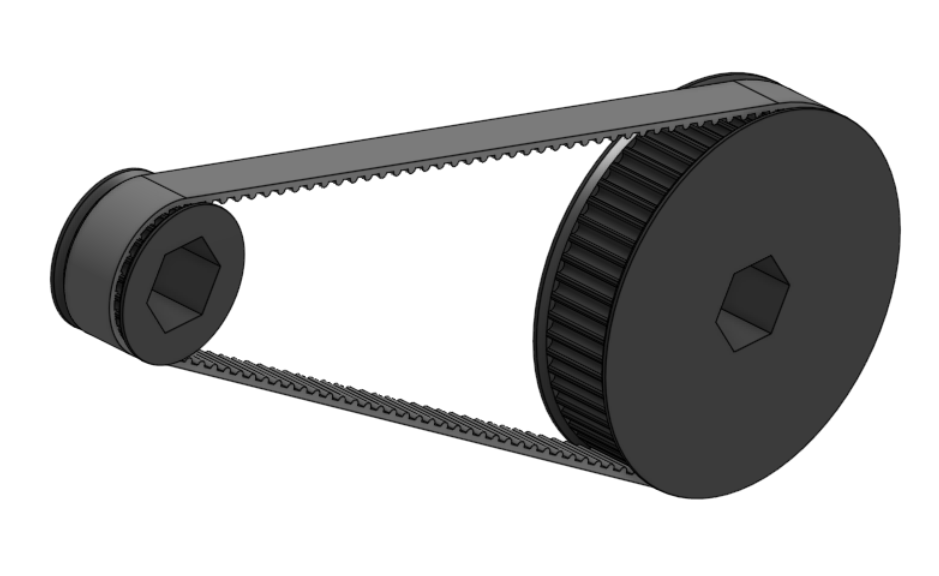
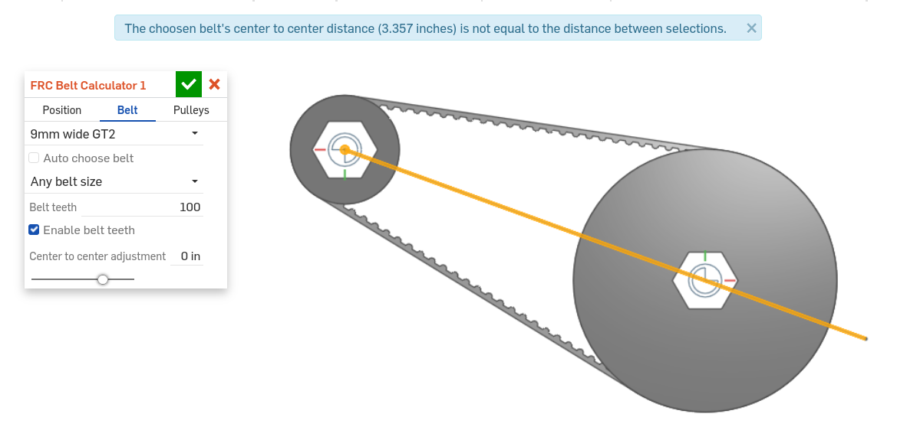

FRC belt calculator
===================

The FRC belt calculator feature allows users to quickly add belt and pulley assemblies to a part studio.
Belts may be either GT2 or HTD, and configurable 3D printable pulleys may also be added.

The FRC belt calculator document can be found here:

Steps for creating belt runs
----------------------------

#. Create an FRC belt calculator feature by selecting it from your :term:`FeatureScript dropdown`.
#. In the **Position** tab:

    * Specify a **Pulley one position** and a **Pulley two position** by selecting vertices or cylindrical faces.
    * If desired, specify an **Offset location** and a **Offset** for your belt run, and use |flip| to reverse the direction of the **Offset**.

    .. image:: positionTab.png
        :width: 40%
        :align: center
        :alt: The position tab

#. In the **Belt** tab:

    * Specify your desired belt standard (**9mm wide GT2**, **9mm wide HTD**, or **15mm wide HTD**).
    * Choose whether you'd like to automatically choose the belt size (**Auto choose belt**) based on the computed center to center distance (as determined by the distance between your desired **Pulley positions**, the teeth of **Pulley one** and **Pulley two**, and the **Center to center adjustment**).
    * Specify a supplier inventory you'd like the belt to be chosen from, or choose **Any belt size** to choose from any available tooth count.
    * If you've chosen to size the belt manually, enter the desired number of **Belt teeth**.
    * Choose whether to **Enable belt teeth** in order to also create an approximate tooth representation.
    * If desired, specify a **Center to center adjustment** to modify the standard belt center to center distance.

    .. image:: beltTab.png
        :width: 40%
        :align: center
        :alt: The belt tab

#. In the **Pulleys** tab:

    * Specify the configurations of **Pulley one** and **Pulley two**:

        * Specify whether you'd like to create a 3D printable **Custom pulley** or **No pulley**.
        * Enter the number of **Pulley teeth**.
        * If you've chosen **Custom pulley**, specify:

            * The **Pulley width**
            * The **Bore type** (**Hex**, **Circular**, **VEXpro spline**, or **None**)
            * The **Bore diameter**
            * Whether to **Enable flanges**
            * The **Flange width** (if flanges are enabled)
            * The **Pulley teeth size adjustment**

    * Choose whether to create the belt run as a single composite part (**Create composite part**).

        .. note::
            Creating a belt run as a single composite part can help simplfy the assembly process later on.

    .. image:: pulleyTab.png
        :width: 40%
        :align: center
        :alt: The pulleys tab

#. |confirm-feature|

Center distance checks
----------------------
When both pulley positions are defined in the **Position** tab, the FRC belt calculator FeatureScript will automatically measure the distance between the selected positions and report a warning if the distance between the belts does not match the center to center distance of the belt run.

.. note:: 
    The belt center to center distance is determined by the number of **Belt teeth**, the teeth of **Pulley one** and **Pulley two**, and the **Center to center adjustment**.

To correct a belt center to center distance error, change the distance between your **Pulley one position** and **Pulley two position** selections to match the value displayed in the error tooltip.

.. tip::
    The error tooltip can be seen at the top of the screen while the FRC belt calculator feature is being edited, or by mousing over a broken FRC belt calculator feature in the :term:`feature tree<Feature tree>`.

    .. image:: beltFeatureListError.png
        :width: 70%
        :align: center
        :alt: An incorrect belt in the feature list
